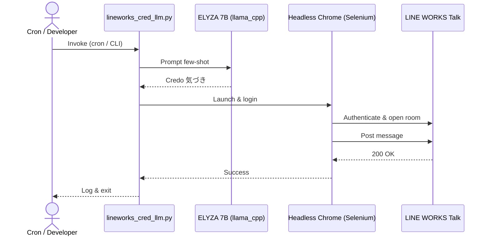
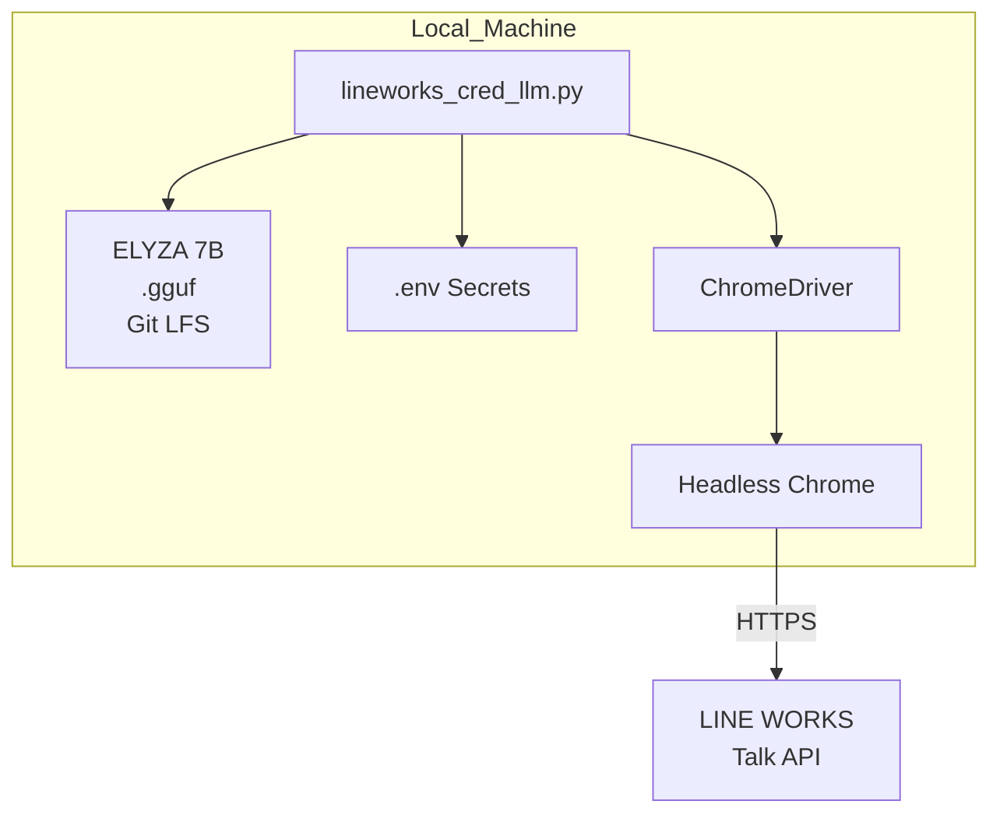

# lineworks-cred-llm

## プロジェクト概要
本リポジトリは、弊社クレド(Credo)の「気づき」を自動生成し、Selenium による RPA 操作で **LINE WORKS** の指定トークルームへレポートを自動投稿する Python スクリプトを収めています。  
社内の朝会・終礼で共有するクレドレポートを人手を介さず配信し、チームの業務効率とナレッジ共有を向上させます。

**注意**: 現在はLLMライブラリの互換性問題により、事前定義されたクレド内容からランダム選択する方式で動作しています。

## 処理フロー
1. `.env` から秘密情報と各種パスを読み込み  
2. 事前定義されたクレド内容からランダムに「気づき」を選択・生成  
3. 祝日判定 (`jpholiday`) と曜日チェックで投稿可否を判断  
4. Selenium + ChromeDriver で Headless Chrome を起動  
5. LINE WORKS へログイン → トークルーム選択 → Ctrl+Enter で本文送信  
6. 完了ログを出力しブラウザをクローズ

## ディレクトリ構成
```
lineworks-cred-llm/
├── src/                         # アプリケーション本体
│   └── lineworks_cred_llm.py
├── cron_logs/                   # 自動実行ログ
├── models/                      # Llama 2 gguf (Git LFS 管理) ※現在未使用
├── .env.example                 # 環境変数テンプレート
├── com.gen.lineworks.cred.llm.plist # macOS launchd設定ファイル
├── requirements.txt             # 依存ライブラリ
├── README.md
└── LICENSE
```

## セットアップ

### 1. リポジトリのクローン
```bash
git clone https://github.com/leadlea/lineworks-slm.git
cd lineworks-cred-llm
```

### 2. 依存関係のインストール
```bash
pip install -r requirements.txt
```

### 3. 環境変数の設定
```bash
cp .env.example .env
# .envファイルを編集して以下を設定:
# LINEWORKS_ID=your_lineworks_id
# LINEWORKS_PASS=your_password
# CHROME_BINARY=/Applications/Google Chrome.app/Contents/MacOS/Google Chrome
# CHROMEDRIVER_PATH=/usr/local/bin/chromedriver
```

### 4. ChromeDriverのインストール
```bash
# Homebrewを使用する場合
brew install chromedriver

# または手動でダウンロード
# https://chromedriver.chromium.org/
```

### 5. 自動実行の設定 (macOS)
```bash
# plistファイルをLaunchAgentsにコピー
cp com.gen.lineworks.cred.llm.plist ~/Library/LaunchAgents/

# サービスを開始
launchctl load ~/Library/LaunchAgents/com.gen.lineworks.cred.llm.plist

# ログディレクトリを作成
mkdir -p cron_logs
```

## 実行

### 手動実行
```bash
python src/lineworks_cred_llm.py              # 通常実行
python src/lineworks_cred_llm.py --dry-run    # ブラウザ操作せず生成文のみ表示
```

### 自動実行スケジュール
- **平日（月〜金）**: 8:58、12:58、17:58に自動実行
- **土日祝日**: 自動スキップ

### ログの確認
```bash
# 出力ログ
tail -f cron_logs/lineworks_cred_llm.out.log

# エラーログ
tail -f cron_logs/lineworks_cred_llm.err.log
```

### サービス管理
```bash
# サービス状態確認
launchctl list | grep lineworks

# サービス停止
launchctl unload ~/Library/LaunchAgents/com.gen.lineworks.cred.llm.plist

# サービス開始
launchctl load ~/Library/LaunchAgents/com.gen.lineworks.cred.llm.plist
```

## シーケンス図


## アーキテクチャ図


## トラブルシューティング

### ChromeDriverのバージョン問題
```bash
# Chromeのバージョン確認
/Applications/Google\ Chrome.app/Contents/MacOS/Google\ Chrome --version

# ChromeDriverのバージョン確認
chromedriver --version

# バージョンが合わない場合は更新
brew upgrade chromedriver
```

### 依存関係の問題
```bash
# 依存関係を再インストール
pip install --upgrade -r requirements.txt
```

### LINE WORKS投稿が失敗する場合
1. `.env`ファイルの認証情報を確認
2. ●Team柳ルームが存在するか確認
3. ログファイルでエラー詳細を確認

## 更新履歴

### v2.0.0 (2025-08-06)
- ChromeDriverの互換性問題を修正
- LLMライブラリの問題を回避（フォールバック機能実装）
- 詳細なログ出力を追加
- macOS launchd設定を修正
- 自動実行スケジュールを改善

### v1.0.0
- 初期リリース
- ELYZA LLMを使用したクレド生成機能

## ライセンス
- **Code**: Apache-2.0  

## 参考
- [Selenium Python Docs](https://selenium-python.readthedocs.io/)
- [LINE WORKS Developers Guide](https://developers.worksmobile.com/)
- [macOS launchd](https://developer.apple.com/library/archive/documentation/MacOSX/Conceptual/BPSystemStartup/Chapters/CreatingLaunchdJobs.html)
