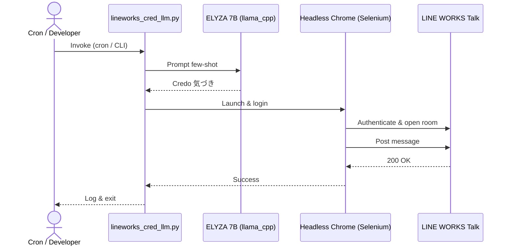
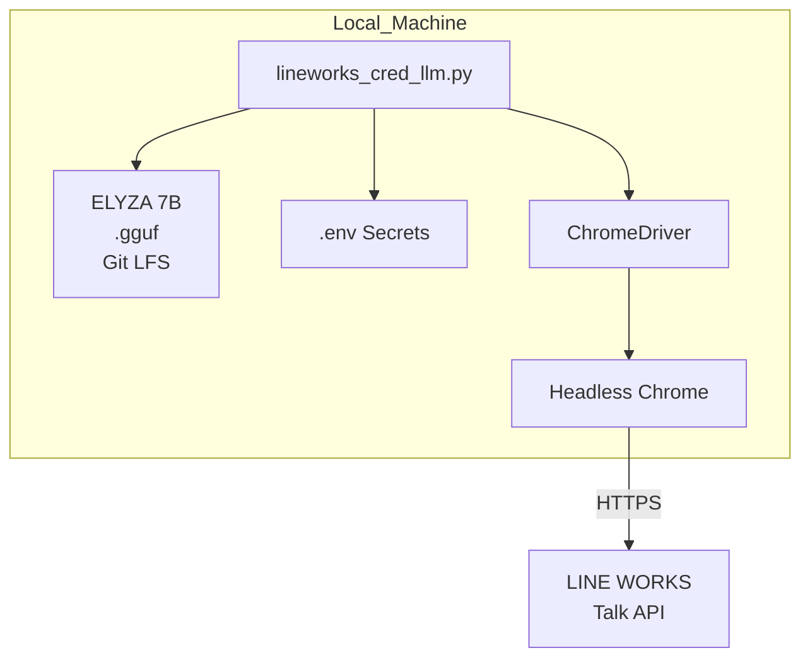

# lineworks-cred-llm

## プロジェクト概要
本リポジトリは、ローカル環境で **ELYZA-japanese-Llama-2-7b-instruct** を用いて弊社クレド(Credo)の「気づき」を自動生成し、Selenium による RPA 操作で **LINE WORKS** の指定トークルームへレポートを自動投稿する Python スクリプトを収めています。  
社内の朝会・終礼で共有するクレドレポートを人手を介さず配信し、チームの業務効率とナレッジ共有を向上させます。

## 処理フロー
1. `.env` から秘密情報と各種パスを読み込み  
2. `llama_cpp` でモデルをロードし Few‑Shot Prompt で 40–60 文字の気づきを生成  
3. 祝日判定 (`jpholiday`) と曜日チェックで投稿可否を判断  
4. Selenium + ChromeDriver で Headless Chrome を起動  
5. LINE WORKS へログイン → トークルーム選択 → Ctrl+Enter で本文送信  
6. 完了ログを出力しブラウザをクローズ

## ディレクトリ構成
```
lineworks-cred-llm/
├── src/                         # アプリケーション本体
│   └── lineworks_cred_llm.py
├── models/                      # Llama 2 gguf (Git LFS 管理)
├── .env.example                 # 環境変数テンプレート
├── requirements.txt             # 依存ライブラリ
├── README.md
└── LICENSE
```

## セットアップ
```bash
git clone https://github.com/yourname/lineworks-cred-llm.git
cd lineworks-cred-llm

# Git LFS (モデル格納用) を有効化
git lfs install

# Python 仮想環境
python -m venv .venv && source .venv/bin/activate
pip install -r requirements.txt

# モデル配置 (例)
mkdir -p models/elyza7b
mv /path/to/ELYZA-japanese-Llama-2-7b-instruct.Q4_0.gguf models/elyza7b/

# 秘密情報
cp .env.example .env
vi .env
```

## 実行
```bash
python src/lineworks_cred_llm.py              # 通常実行
python src/lineworks_cred_llm.py --dry-run    # ブラウザ操作せず生成文のみ表示
```

## シーケンス図


## アーキテクチャ図


## ライセンス
- **Code**: Apache-2.0  
- **Model**: Llama 2 Community License + Apache-2.0 (ELYZA modifications)  

## 参考
- [ELYZA-japanese-Llama-2-7b-instruct – Hugging Face](https://huggingface.co/elyza/ELYZA-japanese-Llama-2-7b-instruct)
- LINE WORKS Developers Guide  
- Selenium Python Docs  
