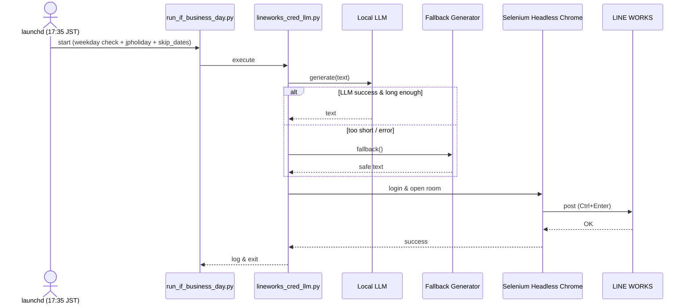

# lineworks-cred-llm

## プロジェクト概要
本リポジトリは、社内クレド（Credo）の「気づき」を**ローカルLLMで生成**し、Selenium による RPA 操作で **LINE WORKS** の指定トークルームへ自動投稿する Python 実装です。  
**精度優先**の設計で、生成〜投稿完了までに数分かかる場合がありますが、**平日 17:35（JST）に起動**し、**18:00 までに投稿**されれば要件を満たします。

- 生成系：ローカルLLM →（短文/失敗）→ **安全フォールバック**（テンプレベース）  
- 投稿系：Selenium + Headless Chrome（Selenium Manager によるドライバ自動解決が基本）

---

## 変更点（What's New）
- **2025-08-20 v3.0.0**
  - ローカルLLM生成の安定化（「短すぎ」検知・**フォールバック `generate_credo_text`** 実装）
  - **平日 17:35（JST）** の単発スケジュールに統一（**土曜除外**）
  - `SKIP_DATES` による**安全テスト**フローを追加（投稿させず配線確認が可能）
  - Selenium 待機の見直し（`page_load_strategy="eager"`、適正タイムアウト）

> 旧記述（ランダム選択方式・1日3回実行・固定ChromeDriver必須など）は廃止・更新済みです。

---

## LLM の選定・導入・設定（今回の更新ポイント）

### 方針（今回）
- **精度優先**：現行のローカルLLMを継続利用（数分の推論時間は許容）。  
- ハードウェア：**MacBook Air / 8GB** を想定。  
- 推奨：7B クラスの **日本語対応 instruct** モデルを **4bit 量子化（Q4 系）**で利用。

> 13B は 8GB 機では実用が厳しいため非推奨。3B〜7B の範囲で品質と速度の妥協点を選びます。

### A) `llama.cpp` / `llama-cpp-python`（GGUF 直接ロード）
現行構成を維持する場合の基本フローです。

1. **依存のインストール**
   ```bash
   # 仮想環境有効化後
   pip install -U llama-cpp-python
   ```

2. **モデルのダウンロード**
   - `models/` ディレクトリを作成し、目的の **.gguf** を配置します。
   - 例：`models/your-model-q4_k_m.gguf`  
     （具体的なモデルは社内合意のものを使用。日本語 instruct かつ Q4 系を推奨）

3. **環境変数（.env もしくは plist）**
   ```bash
   # 例：.env
   LLM_PROVIDER=llamacpp
   LLM_MODEL_PATH=/Users/<YOU>/lineworks-cred-llm/models/your-model-q4_k_m.gguf
   LLM_N_CTX=2048           # 文脈長（必要に応じて増減）
   LLM_N_THREADS=8          # M1 Air は 8 前後が目安
   ```

4. **動作確認（生成のみ）**
   ```bash
   # 当日を SKIP_DATES に入れてから kickstart すると投稿せず生成～RPA配線だけ確認できます
   python run_if_business_day.py
   ```

> `lineworks_cred_llm.py` の `gen_credo_with_local_llm()` が `llama-cpp-python` を使って gguf を直接読み込む想定。短文/例外時は `generate_credo_text()` フォールバックが必ず発火します。

### B) 代替：Ollama ランタイム（任意・選択肢）
Ollama を使うとモデル配布が楽です。**現行モデルの精度を維持したい場合は A のままで OK**。

1. **インストール & モデル取得**
   ```bash
   brew install ollama
   ollama serve &
   # 例：日本語対応の instruct モデルを取得（モデル名は必要に応じて変更）
   ollama pull qwen2.5:7b-instruct-q4_0
   ```
2. **環境変数**
   ```bash
   OLLAMA_URL=http://127.0.0.1:11434
   OLLAMA_MODEL=qwen2.5:7b-instruct-q4_0
   LLM_BUDGET_SEC=240   # 例：最大 4 分（本設計では十分な余裕）
   LLM_MAX_TOKENS=200
   ```
3. **コード側**
   - `gen_credo_with_local_llm()` を Ollama 呼び出しに差し替えるラッパーを用意すると切替が簡単です（本リポジトリにはフォールバックが実装済み）。

> **注意**：Ollama を使う場合も、最終的な品質はモデル選定に依存します。現行モデルの精度を重視する場合は、同等グレードを選んでください。

---

## 処理フロー
1. **投稿可否判定**：平日＆祝日判定（`jpholiday`）／任意の除外日（`skip_dates.txt` と `SKIP_DATES`）  
2. **本文生成**：ローカルLLMで生成 → 短文/失敗時は **フォールバック**で確実に非空本文を返す  
3. **RPA投稿**：Headless Chrome 起動 → LINE WORKS ログイン → 指定ルームへ送信（Ctrl+Enter）  
4. **ログ出力**：`cron_logs/run_if_business_day.{out,err}.log`

---

## ディレクトリ構成
```
lineworks-cred-llm/
├── src/
│   └── lineworks_cred_llm.py       # 本体（生成＋投稿）
├── run_if_business_day.py          # 起動エントリ（平日/祝日/除外日判定）
├── cron_logs/                      # 実行ログ（.gitignore）
├── skip_dates.txt                  # 1行1日付(YYYY-MM-DD)の除外日
├── .env.example                    # 環境変数テンプレート
├── README.md
├── requirements.txt                # 依存（pip）
├── requirements.lock               # 凍結（任意）
└── ops/cron/com.gen.lineworks.cred.plist  # サンプル launchd 設定（macOS）
```

---

## 依存関係 & 前提
- **Python 3.10+**（推奨：3.12）  
- **Google Chrome**（最新系）  
- **Selenium 4.10+**（Selenium Manager が ChromeDriver を自動解決）  
- macOS（自動実行は `launchd` を使用）

---

## セットアップ

### 1) クローン & 仮想環境
```bash
git clone <YOUR_REPO_URL> lineworks-cred-llm
cd lineworks-cred-llm
python -m venv .venv && source .venv/bin/activate
pip install -r requirements.txt
```

### 2) 環境変数（`.env`）
```bash
cp .env.example .env
# 主要項目（例）
# LINEWORKS_ID=your_lineworks_id
# LINEWORKS_PASS=your_password
# CHROME_BINARY=/Applications/Google\ Chrome.app/Contents/MacOS/Google\ Chrome  # 必要に応じて
# LLM_PROVIDER=llamacpp
# LLM_MODEL_PATH=/Users/<YOU>/lineworks-cred-llm/models/your-model-q4_k_m.gguf
# LLM_N_CTX=2048
# LLM_N_THREADS=8
# （Ollama を使う場合）
# OLLAMA_URL=http://127.0.0.1:11434
# OLLAMA_MODEL=qwen2.5:7b-instruct-q4_0
# LLM_BUDGET_SEC=240
# LLM_MAX_TOKENS=200
```
> **ChromeDriver 明示指定は原則不要**（Selenium Manager が自動取得）。必要な場合のみ `CHROMEDRIVER_PATH` を指定。

### 3) ログディレクトリ
```bash
mkdir -p cron_logs
```

---

## 実行

### 手動実行（動作確認）
```bash
# 平日/祝日/除外日を考慮して実行
python run_if_business_day.py

# 生成のみ（投稿しない）を確認したい場合：当日を SKIP_DATES に入れてから kickstart（後述）
```

### 自動実行（macOS `launchd`）
**サンプル `~/Library/LaunchAgents/com.gen.lineworks.cred.plist`**（**平日：月〜金** 17:35、**土曜除外**、JST）

```xml
<?xml version="1.0" encoding="UTF-8"?>
<!DOCTYPE plist PUBLIC "-//Apple//DTD PLIST 1.0//EN" "http://www.apple.com/DTDs/PropertyList-1.0.dtd">
<plist version="1.0"><dict>

  <key>Label</key><string>com.gen.lineworks.cred</string>

  <key>WorkingDirectory</key><string>/Users/<YOU>/lineworks-cred-llm</string>

  <key>ProgramArguments</key>
  <array>
    <string>/Users/<YOU>/lineworks-cred-llm/.venv/bin/python</string>
    <string>/Users/<YOU>/lineworks-cred-llm/run_if_business_day.py</string>
  </array>

  <key>EnvironmentVariables</key>
  <dict>
    <key>PATH</key><string>/usr/local/bin:/opt/homebrew/bin:/usr/bin:/bin</string>
    <key>LANG</key><string>ja_JP.UTF-8</string>
    <key>LC_ALL</key><string>ja_JP.UTF-8</string>
    <key>HEADLESS</key><string>1</string>
    <key>SKIP_DATES</key><string></string>
    <key>WAIT_SEC</key><string>20</string>
  </dict>

  <key>StandardOutPath</key><string>/Users/<YOU>/lineworks-cred-llm/cron_logs/run_if_business_day.out.log</string>
  <key>StandardErrorPath</key><string>/Users/<YOU>/lineworks-cred-llm/cron_logs/run_if_business_day.err.log</string>

  <key>RunAtLoad</key><false/>

  <key>StartCalendarInterval</key>
  <array>
    <dict><key>Hour</key><integer>17</integer><key>Minute</key><integer>35</integer><key>Weekday</key><integer>1</integer></dict>
    <dict><key>Hour</key><integer>17</integer><key>Minute</key><integer>35</integer><key>Weekday</key><integer>2</integer></dict>
    <dict><key>Hour</key><integer>17</integer><key>Minute</key><integer>35</integer><key>Weekday</key><integer>3</integer></dict>
    <dict><key>Hour</key><integer>17</integer><key>Minute</key><integer>35</integer><key>Weekday</key><integer>4</integer></dict>
    <dict><key>Hour</key><integer>17</integer><key>Minute</key><integer>35</integer><key>Weekday</key><integer>5</integer></dict>
  </array>

  <!-- 稀なセッション不一致を避けたい場合のみ -->
  <!-- <key>LimitLoadToSessionType</key><string>Aqua</string> -->

</dict></plist>
```

**読み込み**
```bash
launchctl bootout gui/$(id -u) ~/Library/LaunchAgents/com.gen.lineworks.cred.plist 2>/dev/null || true
launchctl bootstrap gui/$(id -u) ~/Library/LaunchAgents/com.gen.lineworks.cred.plist
launchctl print gui/$(id -u)/com.gen.lineworks.cred | awk '/calendarinterval/,/}/'
```

---

## 安全テスト（投稿せずに配線チェック）
「生成・RPAを通すが**投稿はさせない**」ときは、当日を除外にしてから `kickstart`：
```bash
FILE=~/Library/LaunchAgents/com.gen.lineworks.cred.plist
TODAY=$(date +%F)
plutil -replace EnvironmentVariables.SKIP_DATES -string "$TODAY" "$FILE"
launchctl bootout gui/$(id -u) "$FILE" 2>/dev/null || true
launchctl bootstrap gui/$(id -u) "$FILE"
launchctl kickstart -k gui/$(id -u)/com.gen.lineworks.cred

# 確認後に解除
plutil -replace EnvironmentVariables.SKIP_DATES -string "" "$FILE"
launchctl bootout gui/$(id -u) "$FILE" 2>/dev/null || true
launchctl bootstrap gui/$(id -u) "$FILE"
```

---

## ログ
```bash
# 実行ログ（本文生成・各段階）
tail -n 200 cron_logs/run_if_business_day.out.log

# エラーログ（例外スタック等）
tail -n 200 cron_logs/run_if_business_day.err.log
```

---

## 設定・環境変数
| 変数 | 用途 | 例/備考 |
|---|---|---|
| `LINEWORKS_ID` | ログインID | `.env` |
| `LINEWORKS_PASS` | ログインパスワード | `.env` |
| `HEADLESS` | 1=ヘッドレス | 通常は `1` |
| `CHROME_BINARY` | Chrome 明示パス | 省略可 |
| `SKIP_DATES` | カンマ区切りの除外日 | `2025-08-20,2025-08-21` |
| `WAIT_SEC` | 既定の明示待機秒 | 例：`20` |
| `LLM_PROVIDER` | `llamacpp` / `ollama` など | 既定は `llamacpp` |
| `LLM_MODEL_PATH` | GGUF の絶対パス | llama.cpp 利用時 |
| `LLM_N_CTX` | LLM の文脈長 | 例：`2048` |
| `LLM_N_THREADS` | 推論スレッド数 | M1 Air は 8 前後 |
| `OLLAMA_URL` | Ollama API URL | 例：`http://127.0.0.1:11434` |
| `OLLAMA_MODEL` | `qwen2.5:7b-instruct-q4_0` など | Ollama 利用時 |
| `LLM_BUDGET_SEC` | 生成時間上限（秒） | 例：`240` |
| `LLM_MAX_TOKENS` | 生成トークン上限 | 例：`200` |
| `skip_dates.txt` | 1行1日付の除外日 | 例：`2025-08-13` |

---

## トラブルシューティング

### 投稿されない（発火していない）
- `launchctl print gui/$(id -u)/com.gen.lineworks.cred` で `calendarinterval` を確認  
- ログイン中のユーザーセッションであること（LaunchAgent はログインセッション必須）  
- スリープ回避：`caffeinate -dimsu -t 2400` を 17:25 〜 実施

### 本文生成が極端に短い/失敗する
- ローカルLLMが短文を返した場合は**自動でフォールバック**（`generate_credo_text`）。  
- `err.log` に `too short` があれば想定どおりで、投稿はフォールバックで継続。

### Selenium が遅い
- `opts.page_load_strategy = "eager"`、`driver.set_page_load_timeout(45)` を使用。  
- 固定 `sleep` は最小限。基本は `WebDriverWait(..., timeout=WAIT_SEC)` の**条件付き待機**で安定化。

---

## シーケンス図


---

## アーキテクチャ図
```mermaid
flowchart TD
  subgraph macOS[macOS Workstation]
    subgraph app[App]
      entry[run_if_business_day.py]
      core[src/lineworks_cred_llm.py]
      skip[skip_dates.txt]
      env[.env]
    end
    subgraph rpa[RPA]
      chrome[Headless Chrome]
      sel[Selenium (Manager)]
    end
    logs[(cron_logs/*.log)]

    entry --> core
    core --> logs
    core --> rpa
    core --> env
    entry --> skip
    sel --> chrome
  end

  rpa -->|HTTPS| LW[LINE WORKS Talk]
```

---

## 更新履歴
### v3.0.0 (2025-08-20)
- ローカルLLM生成の安定化（短文検知＆フォールバック）
- 平日 17:35（JST）単発スケジュール、土曜除外
- `SKIP_DATES` による安全テスト手順を追加
- Selenium 待機/ロード戦略の適正化

### v2.0.0 (2025-08-06)
- ChromeDriver 互換性修正、フォールバック導入、ログ強化、launchd整備

### v1.0.0
- 初期リリース（ELYZA LLM ベース）

---

## ライセンス
- **Code**: Apache-2.0

## 参考
- Selenium Python Docs: https://selenium-python.readthedocs.io/  
- LINE WORKS Developers Guide: https://developers.worksmobile.com/  
- Apple: launchd: https://developer.apple.com/library/archive/documentation/MacOSX/Conceptual/BPSystemStartup/Chapters/CreatingLaunchdJobs.html
